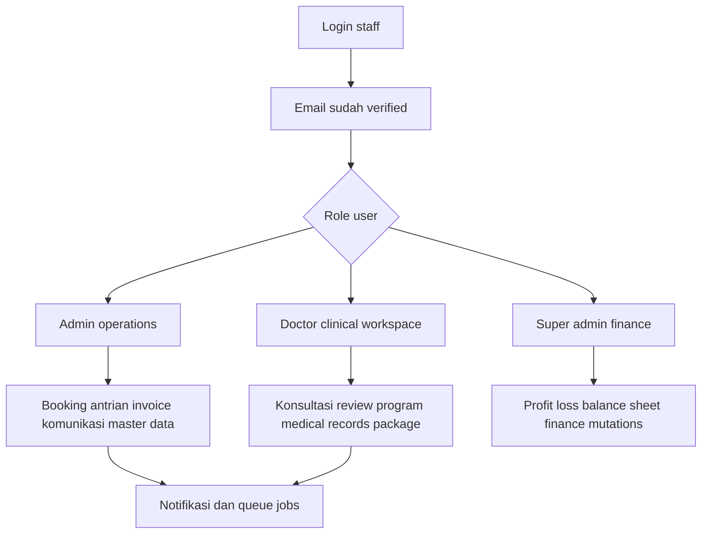
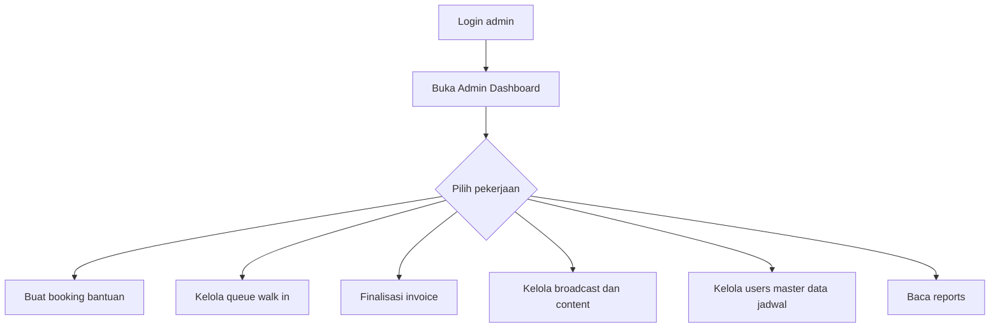
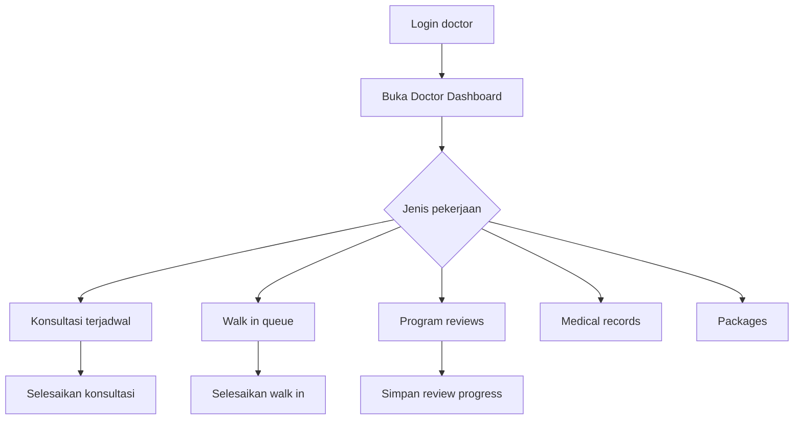
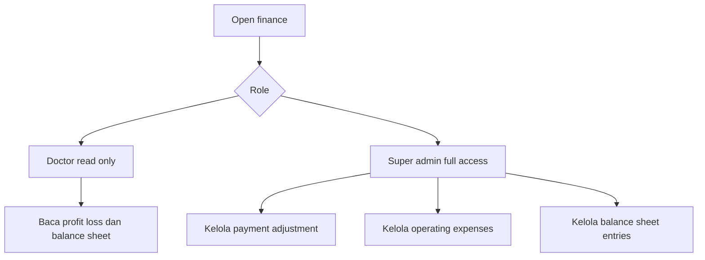

# Cara Menggunakan Aplikasi MORE Clinic

Panduan ini menjelaskan cara memakai aplikasi MORE Clinic sesuai alur sistem terbaru. Aplikasi sekarang berfokus pada workflow operasional klinik: admin mengelola booking dan antrian, doctor menyelesaikan konsultasi, dan super admin mengelola laporan serta data finance.

## Ringkasan Singkat

Aplikasi memiliki 3 role operasional utama:

- **Admin**: mengelola dashboard operasional, booking bantuan, antrian walk-in, invoice, broadcast, konten, user, jadwal klinik, aesthetic program, dan laporan admin.
- **Doctor**: melihat workload konsultasi, mengisi catatan dan metrik konsultasi, menyimpan Google Meet link untuk konsultasi online, menyelesaikan walk-in, meninjau progress program, membuka medical records, dan mengelola package catalog.
- **Super Admin**: membaca laporan finance dan mengelola perubahan finance seperti return, HPP, operating expense, dan balance sheet entry.

Pasien tidak lagi memakai login mandiri di aplikasi. Data pasien dikelola oleh tim klinik sebagai registered patient atau guest patient saat admin membuat booking.

## Alur Besar Aplikasi

## 1. Login dan Akses Umum

### Langkah utama

1. Buka aplikasi lalu klik **Login**.
2. Masukkan email dan password staff.
3. Pastikan akun sudah **verified**.
4. Setelah login, buka **Dashboard**.
5. Sistem akan mengarahkan user ke area sesuai role.

### Catatan akses

- Role **admin** diarahkan ke area admin.
- Role **doctor** diarahkan ke area doctor.
- Role **super_admin** diarahkan ke area finance.
- Jika akun belum verified, fitur operasional tidak bisa dibuka.
- Jika role tidak sesuai dengan halaman, sistem akan menolak akses.

## 2. Panduan Admin

Admin bertanggung jawab mengatur operasional klinik harian. Menu utama admin meliputi **Dashboard**, **Bookings**, **Queue**, **Invoices**, **Reports**, **Broadcasts**, **Content**, **Users**, **Aesthetic Programs**, dan **Schedule Settings**.

### Flow admin

### 2.1 Membaca Admin Dashboard

1. Buka menu **Dashboard**.
2. Tinjau ringkasan pasien, doctor, admin, booking, revenue, package, dan antrian.
3. Lihat daftar booking dan payment terbaru.
4. Perhatikan payment internal treatment yang masih pending.
5. Jika pembayaran treatment sudah diterima onsite, gunakan aksi **Mark paid** bila tersedia.

Hal penting:

- Dashboard menampilkan konteks pasien dari registered patient, guest booking, atau walk-in queue.
- Pending treatment handoff belum dihitung sebagai revenue paid sampai difinalisasi.

### 2.2 Membuat Booking Bantuan

1. Buka menu **Bookings**.
2. Pilih doctor dan tanggal konsultasi.
3. Cari slot yang tersedia.
4. Pilih slot yang sesuai.
5. Pilih tipe pasien.
6. Untuk **registered patient**, pilih pasien dari daftar.
7. Untuk **guest patient**, isi nama dan nomor WhatsApp.
8. Pilih consultation mode: **offline** atau **online**.
9. Tambahkan notes bila diperlukan.
10. Klik tombol konfirmasi booking.

Hal penting:

- Booking bantuan admin langsung berstatus **confirmed**.
- Booking bantuan admin tidak membuat pembayaran Midtrans.
- Booking guest wajib memiliki nomor WhatsApp.
- Booking online membutuhkan Google Meet link dari doctor sebelum konsultasi bisa diselesaikan.

### 2.3 Booking di Luar Jam Klinik

1. Saat mencari slot, cek apakah slot berada di jam operasional klinik.
2. Jika slot berada di luar jam klinik, aktifkan override hanya jika memang diperlukan.
3. Isi alasan override dengan jelas.
4. Simpan booking.

Hal penting:

- Booking standar di luar jam klinik akan ditolak dengan pesan **Appointments are only available during clinic hours.**
- Override di luar jam klinik wajib memiliki alasan.
- Override berhasil akan dicatat di audit log schedule override.

### 2.4 Mengelola Walk-In Queue

1. Buka menu **Queue**.
2. Tambahkan pasien walk-in dengan mengisi nama pasien.
3. Isi nomor phone atau WhatsApp bila ada.
4. Isi complaint notes bila ada.
5. Klik **Add to Queue**.
6. Pada pasien berstatus waiting, pilih doctor aktif.
7. Klik **Assign** untuk menugaskan pasien ke doctor.
8. Pantau status queue dari waiting, assigned, sampai in consultation.
9. Batalkan queue hanya sebelum konsultasi dimulai.

Hal penting:

- Queue dipakai untuk pasien walk-in harian.
- Doctor hanya bisa memulai queue yang sudah assigned ke dirinya.
- Admin hanya bisa cancel queue saat status waiting atau assigned.
- Jika status sudah in consultation, penyelesaian dilakukan oleh doctor.

### 2.5 Finalisasi Invoice Package

1. Buka menu **Invoices**.
2. Lihat daftar invoice package internal yang masih pending.
3. Pastikan invoice memiliki registered patient dan package.
4. Setelah pembayaran diterima onsite, klik finalisasi.

Hal penting:

- Invoice package dibuat dari rekomendasi doctor saat konsultasi selesai.
- Finalisasi invoice package akan mengaktifkan **UserPackage** dan consultation credits.
- Invoice package untuk guest patient tidak bisa difinalisasi sebagai package entitlement.

### 2.6 Finalisasi Treatment Payment

1. Buka **Admin Dashboard** atau halaman finance yang menampilkan pending treatment handoff.
2. Cari payment dengan tipe **consultation_treatment** dan provider **internal**.
3. Setelah pembayaran onsite diterima, klik **Mark paid**.

Hal penting:

- Treatment payment tidak mengaktifkan package.
- Treatment payment tidak memberikan consultation credit.
- Setelah paid, nominal masuk ke revenue cash-basis finance.

### 2.7 Mengirim WhatsApp Broadcast

1. Buka menu **Broadcasts**.
2. Pilih audience scope: **doctors**, **admins**, atau **all_users**.
3. Tulis isi pesan.
4. Klik queue broadcast.
5. Pantau status delivery pada daftar broadcast.

Hal penting:

- Broadcast selalu diproses melalui queue job.
- Broadcast tidak dikirim langsung di dalam request admin.
- Status delivery bisa pending, sent, atau failed.

### 2.8 Mengelola Educational Content

1. Buka menu **Content**.
2. Buat konten baru dengan title, excerpt, body, status, dan asset opsional.
3. Pilih status **draft** jika belum ingin tampil publik.
4. Pilih status **published** jika konten siap tampil di homepage.
5. Simpan konten.
6. Edit konten dari row yang tersedia bila diperlukan.

Hal penting:

- Konten draft tidak tampil di homepage publik.
- Konten published tampil di homepage publik.
- Slug dibuat otomatis dari title.
- Asset dikelola oleh sistem clinic asset.

### 2.9 Mengelola Users

1. Buka menu **Users**.
2. Gunakan search, role filter, verification filter, sort, dan pagination.
3. Untuk membuat akun staff, isi nama, email, phone, role, password, dan verification state.
4. Pilih role **doctor**, **admin**, atau **super_admin**.
5. Jika role doctor, isi data doctor profile seperti specialization dan bio.
6. Centang mark verified jika akun langsung boleh dipakai.
7. Simpan akun.
8. Untuk update akun, buka row user dan simpan perubahan.

Hal penting:

- Role operasional yang valid adalah doctor, admin, dan super_admin.
- Jika akun doctor diubah menjadi role lain, doctor profile tetap disimpan tetapi dibuat inactive.
- Doctor inactive tidak muncul untuk penjadwalan baru.

### 2.10 Mengelola Aesthetic Programs

1. Buka menu **Aesthetic Programs**.
2. Buat atau edit program dengan name, selling price, HPP, dan active state.
3. Simpan perubahan.
4. Nonaktifkan program jika tidak lagi ditawarkan.

Hal penting:

- Doctor hanya melihat aesthetic program yang active.
- Program yang sudah dipakai pada consultation line item tidak dihapus dari histori.
- Data price dan HPP disnapshot saat doctor menyelesaikan konsultasi.

### 2.11 Mengelola Schedule Settings

1. Buka menu **Schedule Settings**.
2. Tambahkan atau edit jam operasional klinik berdasarkan day of week.
3. Isi start time, end time, dan active state.
4. Simpan perubahan.
5. Tinjau recent schedule override audit bila ada.

Hal penting:

- Jam operasional menjadi acuan pencarian slot admin.
- Outside-hours booking membutuhkan override reason.
- Log override membantu audit operasional.

### 2.12 Membaca Admin Reports

1. Buka menu **Reports**.
2. Isi tanggal from dan to.
3. Terapkan filter.
4. Tinjau revenue, package revenue, consultation revenue, dan funnel operasional.

Hal penting:

- Report admin dipakai untuk monitoring operasional.
- Finance report detail berada di menu finance untuk doctor dan super admin.

## 3. Panduan Doctor

Doctor menggunakan aplikasi untuk menangani konsultasi terjadwal, konsultasi walk-in, review program, medical records, dan package catalog.

### Flow doctor

### 3.1 Membaca Doctor Dashboard

1. Buka **Doctor Dashboard**.
2. Lihat jadwal konsultasi terkonfirmasi.
3. Periksa next consultation.
4. Periksa active patient programs.
5. Periksa pending reviews.
6. Periksa clinic schedule.

Hal penting:

- Doctor hanya melihat workload miliknya.
- Consultation card akan menunjukkan apakah konsultasi siap diselesaikan atau masih membutuhkan meeting link.

### 3.2 Menyimpan Google Meet Link

1. Buka konsultasi online admin-assisted yang assigned ke doctor.
2. Masukkan link Google Meet.
3. Pastikan URL menggunakan host **meet.google.com**.
4. Simpan link.

Hal penting:

- Link wajib untuk konsultasi online admin-assisted.
- Konsultasi online tidak bisa diselesaikan sebelum link tersedia.
- Setelah link disimpan, pasien atau guest akan mendapatkan notifikasi.

### 3.3 Menyelesaikan Konsultasi Terjadwal

1. Buka menu **Consultations**.
2. Pilih booking confirmed yang assigned ke doctor.
3. Buka workspace konsultasi.
4. Baca intake notes dan konteks pasien.
5. Isi consultation notes atau minimal satu metrik Slimming Monitoring Form.
6. Pilih recommended package bila pasien perlu package lanjutan.
7. Isi meal plan summary bila perlu.
8. Tambahkan treatment line item bila ada tindakan berbayar.
9. Submit completion.

Hal penting:

- Doctor hanya bisa menyelesaikan booking miliknya.
- Booking harus berstatus confirmed.
- Notes atau minimal satu metrik slimming wajib ada.
- Recommended package membuat invoice internal untuk admin.
- Chargeable treatment line membuat payment internal treatment untuk admin collection.
- Setelah selesai, booking menjadi completed dan follow-up notification akan di-queue.

### 3.4 Mengisi Treatment Line Items

1. Pilih primary package option bila dipakai.
2. Jika memakai Diamond oral add-on, pastikan primary option adalah Diamond.
3. Tambahkan aesthetic program lines bila ada.
4. Tambahkan manual treatment lines bila ada tindakan manual.
5. Isi quantity, dosage, unit price, notes, dan detail lain sesuai kebutuhan.
6. Submit consultation completion.

Hal penting:

- Empty dosage hanya warning di UI, bukan blocker server.
- Dosage unit default adalah **ml**.
- Aesthetic program menyimpan snapshot selling price dan HPP.
- Manual treatment menyimpan HPP nol kecuali master data menyediakan HPP melalui program.
- Jika total line item lebih dari nol, sistem membuat pending internal treatment payment.

### 3.5 Menangani Walk-In Queue

1. Doctor dashboard akan memantau queue aktif milik doctor.
2. Jika ada pasien assigned, klik start consultation.
3. Sistem mengubah status queue menjadi in consultation.
4. Buka workspace walk-in.
5. Isi notes atau Slimming Monitoring Form metrics.
6. Tambahkan treatment line item bila ada tindakan berbayar.
7. Submit completion.

Hal penting:

- Doctor hanya bisa start queue yang assigned ke dirinya.
- Doctor hanya bisa membuka workspace queue yang statusnya in consultation.
- Walk-in completion membuat consultation dengan queue entry link.
- Walk-in tidak membuat package entitlement invoice.
- Treatment charge tetap bisa menjadi internal treatment payment.

### 3.6 Review Program Progress

1. Buka menu **Program Reviews**.
2. Lihat active program pasien yang berasal dari consultation doctor tersebut.
3. Pilih progress check-in yang belum direview.
4. Buka workspace review.
5. Isi review notes.
6. Submit review.

Hal penting:

- Review disimpan pada row check-in yang sama.
- Setelah review tersimpan, pasien mendapatkan notifikasi review available.
- Weekly progress tidak mengurangi consultation credits package.

### 3.7 Membuka Medical Records

1. Buka menu **Medical Records**.
2. Gunakan filter search, category, patient, atau date window.
3. Pilih record consultation atau progress.
4. Consultation record bersifat read-only.
5. Progress record dapat diedit jika memang milik pasien doctor tersebut.

Hal penting:

- Medical records menggabungkan completed consultation dan progress check-in.
- Attachment seperti meal plan, progress photo, dan supporting document dibuka melalui temporary URL.

### 3.8 Mengelola Packages

1. Buka menu **Packages**.
2. Buat package baru dengan name, description, price, duration, type, credits, dan active state.
3. Edit package jika ada perubahan.
4. Deactivate package jika tidak lagi ditawarkan.
5. Delete hanya bisa dilakukan jika package belum punya histori penggunaan.

Hal penting:

- Package catalog bersifat global, bukan doctor-specific.
- Package active muncul untuk pilihan doctor.
- Package yang sudah punya payment, user package, atau rekomendasi consultation sebaiknya dinonaktifkan, bukan dihapus.

## 4. Panduan Super Admin dan Finance

Super admin memiliki akses penuh untuk membaca dan mengubah data finance. Doctor dapat membaca finance report, tetapi tidak dapat melakukan mutation.

### Flow finance

### 4.1 Membaca Profit and Loss

1. Buka **Finance** lalu pilih **Profit and Loss**.
2. Isi date range.
3. Tinjau gross revenue, returns, total revenue, HPP, gross profit, operating expenses, dan net income.
4. Tinjau pending treatment handoff jika ada.

Hal penting:

- Profit and loss bersifat cash-basis.
- Hanya payment paid yang masuk revenue.
- Pending treatment handoff ditampilkan terpisah dan belum dihitung sebagai revenue paid.

### 4.2 Membaca Balance Sheet

1. Buka **Finance** lalu pilih **Balance Sheet**.
2. Pilih as-of date.
3. Tinjau cash, retained earnings, manual assets, equity, liabilities, total, dan variance.

Hal penting:

- Cash dan retained earnings dihitung dari cumulative net income.
- Manual balance sheet entries melengkapi asset, equity, dan liability.
- Report ini adalah managerial view sederhana, bukan full double-entry accounting.

### 4.3 Mengubah Payment Adjustment

1. Login sebagai super admin.
2. Buka finance report yang menampilkan payment adjustment control.
3. Pilih paid payment yang perlu disesuaikan.
4. Isi return amount jika ada refund atau return.
5. Isi HPP amount jika ada cost yang perlu dicatat.
6. Simpan perubahan.

Hal penting:

- Payment adjustment hanya untuk payment yang sudah paid.
- Return amount tidak boleh melebihi payment amount.
- HPP amount tidak boleh negatif.

### 4.4 Mengelola Operating Expenses

1. Login sebagai super admin.
2. Buka finance profit and loss.
3. Tambahkan operating expense dengan name, category opsional, amount, expense date, dan notes opsional.
4. Edit expense jika ada koreksi.
5. Delete expense jika tidak perlu dipakai.

Hal penting:

- Operating expense memengaruhi net income.
- Delete memakai soft delete sehingga histori database tetap aman.

### 4.5 Mengelola Balance Sheet Entries

1. Login sebagai super admin.
2. Buka finance balance sheet.
3. Tambahkan entry dengan side: asset, equity, atau liability.
4. Isi label, category opsional, amount, entry date, dan notes opsional.
5. Edit atau delete entry jika perlu.

Hal penting:

- Entry manual memengaruhi total balance sheet.
- Delete memakai soft delete.
- Side harus asset, equity, atau liability.

## 5. Notifikasi dan Reminder

Sistem menggunakan queue job untuk mengirim notifikasi agar request user tetap cepat dan aman.

### Jenis notifikasi

- Booking confirmation.
- Admin booking confirmation.
- Doctor link request.
- Meeting link ready.
- Day-before dan same-day booking reminder.
- Consultation completion follow-up.
- Package activation.
- Weekly check-in reminder.
- Weekly review available.
- WhatsApp broadcast.

### Hal penting

- Broadcast WhatsApp selalu diproses asynchronous.
- Jika nomor phone atau email kosong, sistem akan skip channel tersebut.
- Provider WhatsApp dapat berupa log, Fonnte, atau Wablas sesuai environment.
- Scheduler harus berjalan agar slot lock release dan reminder tetap aktif.

## 6. Clinic Assets dan File

File klinik seperti avatar doctor, asset content, meal plan PDF, progress photo, dan supporting document dikelola oleh clinic asset service.

### Hal penting

- File disimpan pada disk sesuai konfigurasi **CLINIC_ASSET_DISK**.
- Akses file memakai temporary signed URL.
- Link file bisa expired, sehingga buka file dari halaman aplikasi saat dibutuhkan.

## 7. Istilah Status yang Sering Muncul

- **Booking pending**: booking menunggu pembayaran pada flow retained Midtrans.
- **Booking confirmed**: booking siap ditangani doctor.
- **Booking completed**: konsultasi sudah diselesaikan doctor.
- **Booking cancelled**: booking batal atau payment gagal.
- **Queue waiting**: pasien walk-in baru masuk antrian.
- **Queue assigned**: pasien walk-in sudah ditugaskan ke doctor.
- **Queue in consultation**: doctor sudah memulai konsultasi walk-in.
- **Queue completed**: konsultasi walk-in selesai.
- **Payment pending**: invoice atau payment belum dibayar.
- **Payment paid**: payment sudah final dan masuk perhitungan finance jika relevan.
- **Payment failed**: payment gagal atau dibatalkan.
- **Package active**: package pasien sedang berjalan.
- **Package completed**: consultation credits package sudah habis.

## 8. Urutan Paling Mudah untuk Memahami Aplikasi

1. Admin membuat booking bantuan atau menerima pasien walk-in.
2. Doctor menjalankan konsultasi sesuai booking atau queue.
3. Doctor menyimpan notes, metrics, package recommendation, dan treatment line bila ada.
4. Admin memfinalisasi invoice package atau treatment payment setelah collection onsite.
5. Jika package aktif, doctor dapat meninjau weekly progress pasien.
6. Super admin membaca dan mengelola finance berdasarkan payment paid, HPP, returns, operating expense, dan balance sheet entry.

## 9. Link Dokumentasi Flowchart

Untuk melihat diagram teknis yang lebih detail, buka file berikut di repository:

- `docs/flowcharts/index.html`
- `docs/flowcharts/system-architecture.html`
- `docs/flowcharts/admin-operations.html`
- `docs/flowcharts/doctor-clinical.html`
- `docs/flowcharts/payments-finance.html`
- `docs/flowcharts/notifications-reminders.html`

## 10. Kesimpulan

Cara paling mudah memakai aplikasi adalah memahami tanggung jawab tiap role:

- **Admin** menjalankan operasional klinik harian.
- **Doctor** menangani konsultasi, treatment record, progress review, dan package catalog.
- **Super Admin** mengelola finance mutation dan membaca laporan keuangan lengkap.

Dengan alur ini, setiap staff dapat fokus pada menu sesuai tanggung jawabnya tanpa perlu memahami detail teknis seluruh sistem.
