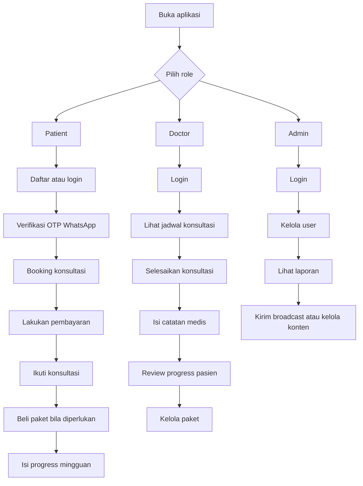
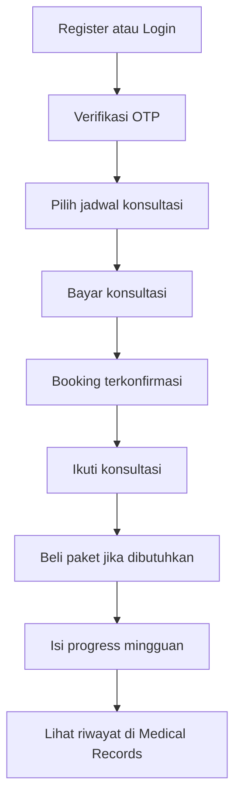
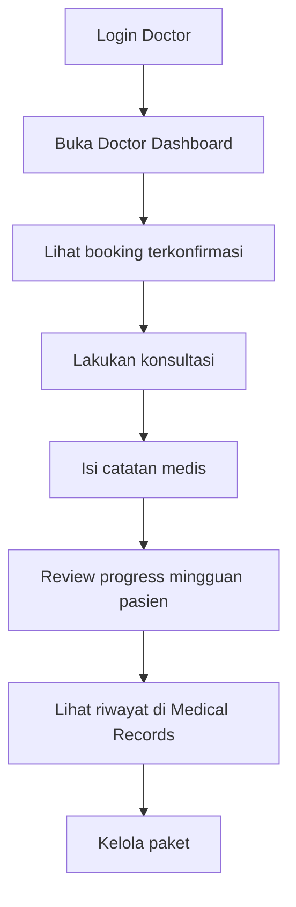
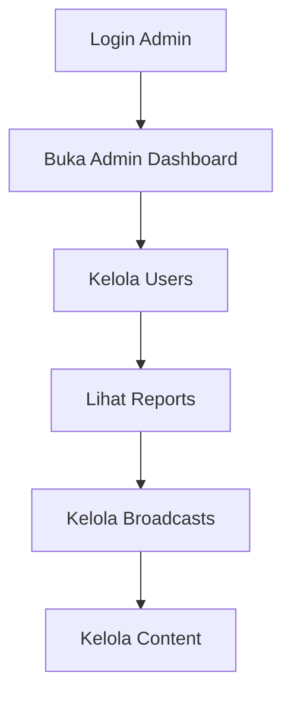

# Cara Menggunakan Aplikasi MORE Clinic

Dokumen ini dibuat untuk membantu pengguna memahami cara memakai aplikasi dengan cepat dan mudah.

## Ringkasan Singkat

Aplikasi ini memiliki 3 role utama:

- **Patient**: untuk pasien yang ingin daftar, booking konsultasi, membeli paket, dan mengirim progress mingguan.
- **Doctor**: untuk dokter yang menangani konsultasi, mengelola paket, memberi catatan medis, dan meninjau progress pasien.
- **Admin**: untuk tim admin yang mengelola user, laporan, broadcast, dan konten edukasi.

## Alur Besar Penggunaan Aplikasi

## 1. Cara Pakai untuk Patient

### Langkah utama

1. Buka aplikasi lalu lakukan **registrasi** atau **login**.
2. Setelah registrasi, lakukan **verifikasi OTP WhatsApp**.
3. Masuk ke menu **Book Consultation**.
4. Pilih dokter dan jadwal yang tersedia.
5. Lanjutkan ke **pembayaran konsultasi**.
6. Setelah pembayaran berhasil, booking akan dikonfirmasi.
7. Ikuti konsultasi sesuai jadwal.
8. Setelah konsultasi selesai, pasien bisa membuka halaman **Packages**.
9. Jika sesuai, pasien dapat membeli paket program.
10. Selama program berjalan, pasien mengirim **progress mingguan**.
11. Riwayat konsultasi dan progress dapat dilihat di **Medical Records**.

### Flow patient

### Hal penting untuk patient

- Akun patient harus **terverifikasi** sebelum bisa memakai fitur utama.
- Jadwal konsultasi baru benar-benar aman setelah pembayaran berhasil.
- Progress mingguan penting agar dokter dapat memantau perkembangan pasien.

## 2. Cara Pakai untuk Doctor

### Langkah utama

1. Login menggunakan akun doctor.
2. Buka **Doctor Dashboard**.
3. Lihat daftar konsultasi yang sudah terkonfirmasi.
4. Lakukan konsultasi sesuai jadwal.
5. Setelah konsultasi selesai, isi **catatan konsultasi**.
6. Jika perlu, berikan rekomendasi lanjutan kepada pasien.
7. Buka menu **Program Reviews** untuk meninjau progress mingguan pasien.
8. Isi review atau feedback untuk progress yang dikirim patient.
9. Gunakan **Medical Records** untuk melihat riwayat pasien.
10. Kelola paket melalui menu **Packages**.

### Flow doctor

### Hal penting untuk doctor

- Doctor hanya menangani booking yang memang ditugaskan kepadanya.
- Konsultasi dianggap selesai setelah catatan konsultasi disimpan.
- Feedback progress mingguan membantu pasien menjalankan program dengan benar.
- Doctor bertanggung jawab mengelola paket yang ditawarkan ke pasien.

## 3. Cara Pakai untuk Admin

### Langkah utama

1. Login menggunakan akun admin.
2. Buka **Admin Dashboard**.
3. Kelola data user pada menu **Users**.
4. Pantau performa aplikasi pada menu **Reports**.
5. Kirim pesan massal melalui menu **Broadcasts**.
6. Kelola artikel atau konten edukasi melalui menu **Content**.

### Flow admin

### Hal penting untuk admin

- Admin bertugas mengelola operasional aplikasi, bukan menjalankan konsultasi.
- Broadcast dikirim melalui sistem antrean agar proses lebih aman dan rapi.

## 4. Penjelasan Role dengan Bahasa Sederhana

- **Patient**: pengguna yang menerima layanan klinik.
- **Doctor**: pengguna yang memberikan konsultasi dan evaluasi medis.
- **Admin**: pengguna yang mengatur sistem dan operasional aplikasi.

## 5. Urutan Paling Mudah untuk Memahami Aplikasi

Jika baru pertama kali melihat aplikasi ini, pahami urutannya seperti ini:

1. **Patient masuk dan verifikasi akun**.
2. **Patient booking lalu bayar konsultasi**.
3. **Doctor menjalankan konsultasi dan mengisi catatan**.
4. **Patient membeli paket dan mengirim progress mingguan**.
5. **Doctor meninjau progress pasien**.
6. **Admin memantau dan mengelola seluruh operasional**.

## 6. Kesimpulan

Cara paling mudah memahami aplikasi ini adalah melihatnya dari fungsi tiap role:

- **Patient**: daftar, verifikasi, booking, bayar, konsultasi, ikut program.
- **Doctor**: lihat jadwal, konsultasi, isi catatan, review progress, kelola paket.
- **Admin**: kelola user, laporan, broadcast, dan konten.

Dengan alur ini, setiap pengguna bisa langsung fokus pada menu yang sesuai dengan perannya.
