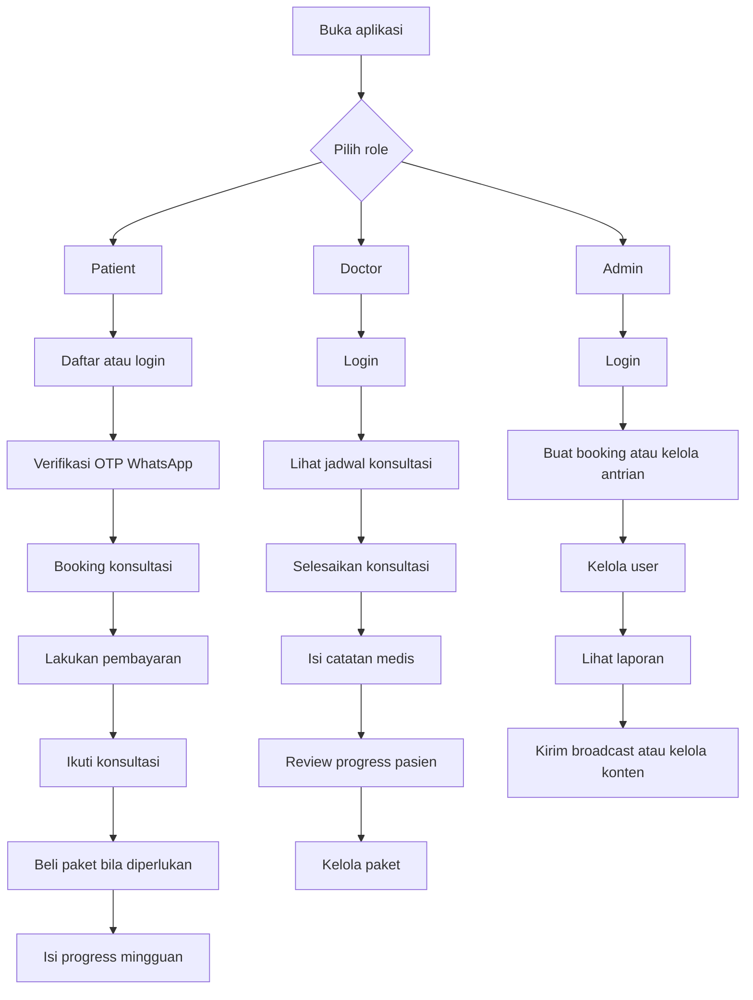
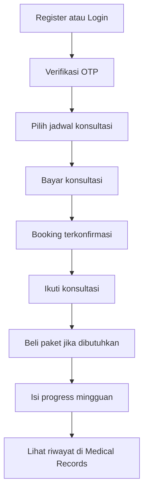
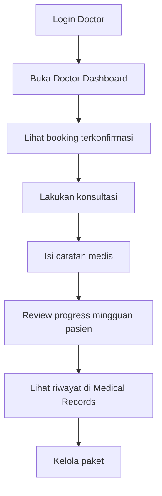
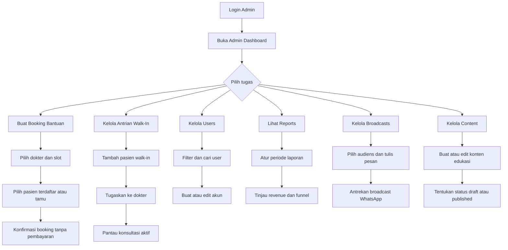

# Cara Menggunakan Aplikasi MORE Clinic

Dokumen ini dibuat untuk membantu pengguna memahami cara memakai aplikasi dengan cepat dan mudah.

## Ringkasan Singkat

Aplikasi ini memiliki 3 role utama:

- **Patient**: untuk pasien yang ingin daftar, booking konsultasi, membeli paket, dan mengirim progress mingguan.
- **Doctor**: untuk dokter yang menangani konsultasi, mengelola paket, memberi catatan medis, dan meninjau progress pasien.
- **Admin**: untuk tim admin yang mengelola user, laporan, broadcast, dan konten edukasi.

## Alur Besar Penggunaan Aplikasi

## 1. Cara Pakai untuk Patient

### Langkah utama

1. Buka aplikasi lalu lakukan **registrasi** atau **login**.
2. Setelah registrasi, lakukan **verifikasi OTP WhatsApp**.
3. Masuk ke menu **Book Consultation**.
4. Pilih dokter dan jadwal yang tersedia.
5. Lanjutkan ke **pembayaran konsultasi**.
6. Setelah pembayaran berhasil, booking akan dikonfirmasi.
7. Ikuti konsultasi sesuai jadwal.
8. Setelah konsultasi selesai, pasien bisa membuka halaman **Packages**.
9. Jika sesuai, pasien dapat membeli paket program.
10. Selama program berjalan, pasien mengirim **progress mingguan**.
11. Riwayat konsultasi dan progress dapat dilihat di **Medical Records**.

### Flow patient

### Hal penting untuk patient

- Akun patient harus **terverifikasi** sebelum bisa memakai fitur utama.
- Jadwal konsultasi baru benar-benar aman setelah pembayaran berhasil.
- Progress mingguan penting agar dokter dapat memantau perkembangan pasien.

## 2. Cara Pakai untuk Doctor

### Langkah utama

1. Login menggunakan akun doctor.
2. Buka **Doctor Dashboard**.
3. Lihat daftar konsultasi yang sudah terkonfirmasi.
4. Lakukan konsultasi sesuai jadwal.
5. Setelah konsultasi selesai, isi **catatan konsultasi**.
6. Jika perlu, berikan rekomendasi lanjutan kepada pasien.
7. Buka menu **Program Reviews** untuk meninjau progress mingguan pasien.
8. Isi review atau feedback untuk progress yang dikirim patient.
9. Gunakan **Medical Records** untuk melihat riwayat pasien.
10. Kelola paket melalui menu **Packages**.

### Flow doctor

### Hal penting untuk doctor

- Doctor hanya menangani booking yang memang ditugaskan kepadanya.
- Konsultasi dianggap selesai setelah catatan konsultasi disimpan.
- Feedback progress mingguan membantu pasien menjalankan program dengan benar.
- Doctor bertanggung jawab mengelola paket yang ditawarkan ke pasien.

## 3. Cara Pakai untuk Admin

### Langkah utama

1. Login menggunakan akun admin.
2. Buka **Admin Dashboard** untuk memantau statistik klinik, booking terbaru, dan ringkasan antrian walk-in.
3. Kelola **Booking** bantuan untuk pasien terdaftar maupun tamu tanpa akun.
4. Kelola **Queue** untuk menerima pasien walk-in dan menugaskan ke dokter.
5. Kelola data user pada menu **Users**.
6. Pantau performa aplikasi pada menu **Reports**.
7. Kirim pesan massal melalui menu **Broadcasts**.
8. Kelola artikel atau konten edukasi melalui menu **Content**.

### Flow admin

### 3.1 Cara Membuat Booking Bantuan (Bookings)

1. Buka menu **Bookings** dari sidebar admin.
2. Pilih **dokter** dan **tanggal** yang diinginkan.
3. Klik **Search slots** untuk melihat jadwal tersedia.
4. Pilih salah satu slot yang muncul.
5. Tentukan tipe pasien:
    - **Registered patient**: pilih dari daftar pasien yang sudah terdaftar.
    - **Guest**: masukkan nama dan nomor WhatsApp tamu.
6. Pilih **consultation mode**: Offline (kunjungan klinik) atau Online (Google Meet).
7. Tambahkan catatan bila perlu, lalu klik **Confirm booking**.
8. Booking langsung dikonfirmasi tanpa melalui Midtrans.

### Hal penting untuk Bookings

- Booking bantuan admin **tidak memerlukan pembayaran** dan langsung berstatus confirmed.
- Untuk konsultasi **online**, dokter perlu menyediakan link Google Meet sebelum konsultasi bisa diselesaikan.
- Booking tamu **wajib** menyertakan nomor WhatsApp.

### 3.2 Cara Mengelola Antrian Walk-In (Queue)

1. Buka menu **Queue** dari sidebar admin.
2. Tambah pasien walk-in dengan mengisi:
    - **Patient Name** (wajib)
    - **WhatsApp / Phone Number** (opsional)
    - **Complaint Notes** (opsional)
3. Klik **Add to Queue** untuk memasukkan ke antrian.
4. Di bagian **Waiting Patients**, pilih dokter lalu klik **Assign** untuk menugaskan pasien ke dokter.
5. Pantau bagian **Active Consultations** untuk melihat pasien yang sedang ditangani.
6. Gunakan **Doctor Availability** di sidebar kanan untuk melihat status dokter secara real-time.
7. Halaman otomatis refresh setiap 5 detik untuk menampilkan data terbaru.

### Hal penting untuk Queue

- Antrian bersifat **harian** dan hanya untuk pasien walk-in.
- Dokter hanya bisa menangani **satu pasien** pada satu waktu.
- Antrian bisa dibatalkan kapan saja oleh admin.

### 3.3 Cara Mengelola Users

1. Buka menu **Users** dari sidebar admin.
2. Gunakan **Directory filters** untuk mencari berdasarkan nama, email, telepon, role, atau status verifikasi.
3. Untuk membuat akun baru, isi formulir **Create account**:
    - Tentukan role: patient, doctor, atau admin.
    - Untuk role doctor, lengkapi specialization, bio, dan consultation fee.
    - Centang **Mark as verified** jika akun perlu langsung diverifikasi.
4. Klik **Create account**.
5. Untuk mengedit user yang sudah ada, ubah data di kartu user lalu klik **Save user**.

### Hal penting untuk Users

- Akun admin dan doctor **harus dibuat oleh tim**, bukan melalui registrasi publik.
- Mengubah role doctor ke role lain akan **mempertahankan profil doctor** tetapi menjadikannya tidak aktif untuk penjadwalan.
- Akun yang dicentang verified tidak perlu lagi melalui OTP WhatsApp.

### 3.4 Cara Membaca Reports

1. Buka menu **Reports** dari sidebar admin.
2. Atur periode dengan mengisi tanggal **From** dan **To**.
3. Klik **Apply filters**.
4. Tinjau metrik yang muncul:
    - **Consultation revenue** dan **Package revenue** secara terpisah.
    - **Total paid revenue** sebagai gabungan.
    - **Conversion funnel** dari registrasi hingga pembelian paket.

### 3.5 Cara Mengirim Broadcast (Broadcasts)

1. Buka menu **Broadcasts** dari sidebar admin.
2. Pilih **audience scope**: verified patients, all patients, doctors, admins, atau all users.
3. Tulis pesan WhatsApp di kolom **Message**.
4. Klik **Queue broadcast**.
5. Pengiriman diproses secara asinkron, jadi admin bisa memantau hasilnya di riwayat broadcast.

### Hal penting untuk Broadcasts

- Hanya audience scope yang sudah disetujui yang bisa dipilih.
- Broadcast dikirim melalui **sistem antrean** agar proses lebih aman dan rapi.
- Hasil pengiriman menampilkan jumlah recipient, sent, dan failed.

### 3.6 Cara Mengelola Content

1. Buka menu **Content** dari sidebar admin.
2. Untuk membuat konten baru, isi formulir **Create content**:
    - **Title**, **Excerpt**, dan **Body**.
    - Pilih status: **draft** atau **published**.
    - Lampirkan file asset bila perlu.
3. Klik **Create content**.
4. Untuk mengedit konten yang sudah ada, ubah data di kartu konten lalu klik **Save content**.
5. Konten berstatus **published** akan tampil di halaman publik.

### Hal penting untuk Content

- Konten berstatus **draft** tidak terlihat oleh pengguna publik.
- Asset bisa diganti kapan saja melalui formulir edit.
- Slug dibuat otomatis berdasarkan title.

## 4. Penjelasan Role dengan Bahasa Sederhana

- **Patient**: pengguna yang menerima layanan klinik.
- **Doctor**: pengguna yang memberikan konsultasi dan evaluasi medis.
- **Admin**: pengguna yang mengatur sistem dan operasional aplikasi.

## 5. Urutan Paling Mudah untuk Memahami Aplikasi

Jika baru pertama kali melihat aplikasi ini, pahami urutannya seperti ini:

1. **Patient masuk dan verifikasi akun**.
2. **Patient booking lalu bayar konsultasi**.
3. **Doctor menjalankan konsultasi dan mengisi catatan**.
4. **Patient membeli paket dan mengirim progress mingguan**.
5. **Doctor meninjau progress pasien**.
6. **Admin memantau dan mengelola seluruh operasional**, termasuk booking bantuan dan antrian walk-in.

## 6. Kesimpulan

Cara paling mudah memahami aplikasi ini adalah melihatnya dari fungsi tiap role:

- **Patient**: daftar, verifikasi, booking, bayar, konsultasi, ikut program.
- **Doctor**: lihat jadwal, konsultasi, isi catatan, review progress, kelola paket.
- **Admin**: kelola booking bantuan, antrian walk-in, user, laporan, broadcast, dan konten.

Dengan alur ini, setiap pengguna bisa langsung fokus pada menu yang sesuai dengan perannya.
